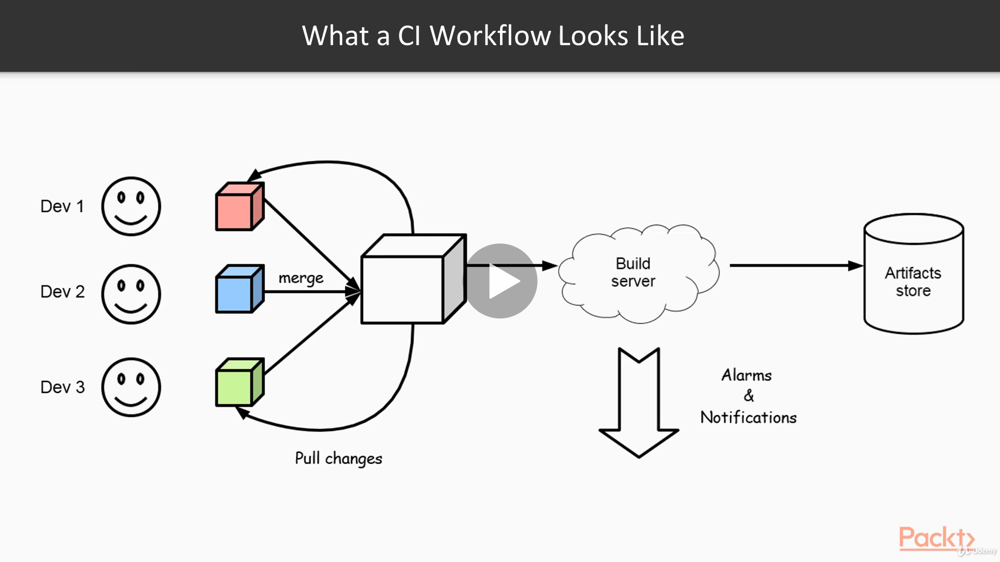
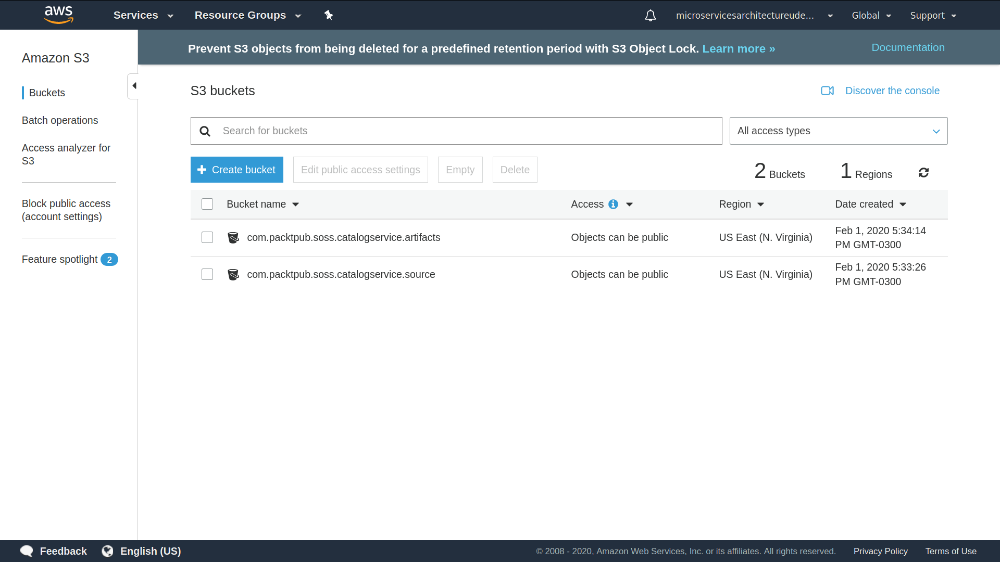
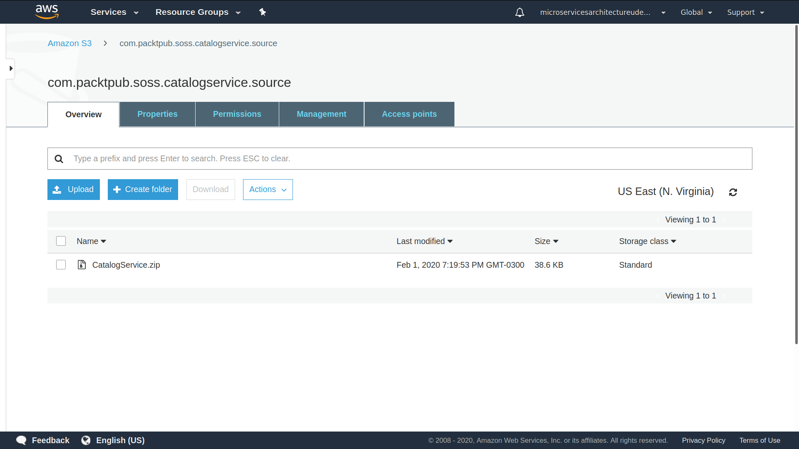
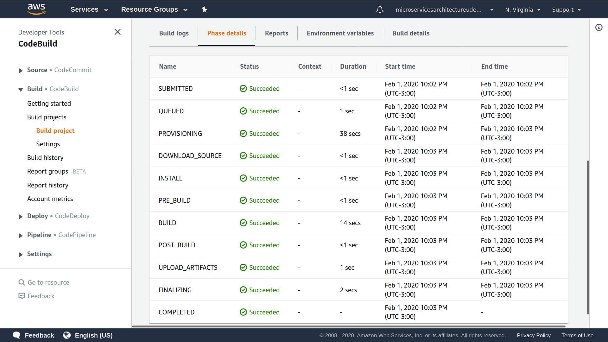
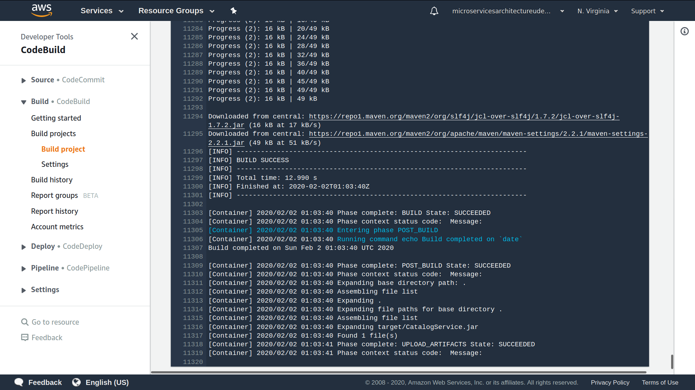
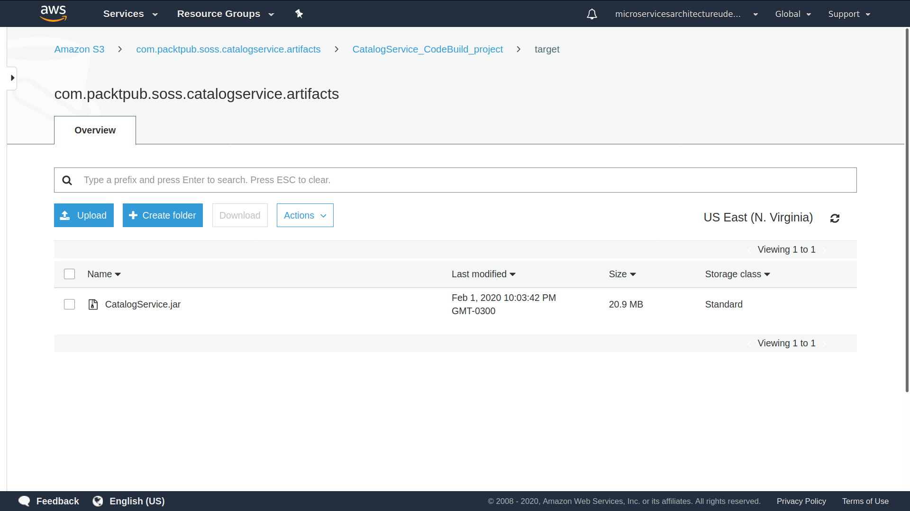

# Microservices Architecture

## Reference Documentation

This project is a summary to the second part of Dimos Raptis's course on Udemy.

It is based primarily on the references below:

* [Microservices Architecture](https://www.udemy.com/course/microservices-architecture/)

* [S3 Bucket Store KMS Encrypted Objects](https://aws.amazon.com/pt/premiumsupport/knowledge-center/s3-bucket-store-kms-encrypted-objects/)


### Features

These are the key features that we'll cover in this project:

- Continuous Integration (CI) in the Cloud

- AWS CodeBuild

- AWS S3 (Simple Storage Service)

- AWS KMS (Key Management Service)


## Continuous Integration using AWS CodeBuild

In the previous part, we developed our fist Microservice and deployed it to the Cloud.

In this part, we will explain what Continuous Integration is, why it is useful and how it can be implemented.

Fist of all, let's give an initial definition of what Continuous Itegration (CI) is.

`It's a practice of merging the working copies of each developer to the shared repository multiple times a day.`

But why is it important?

In the demo we did previously, we worked individually. However, in real life, software is developed in teams. So, there should be a way for the various developers to collaborate and take each other code changes easily and without of a lot of additional work.

Let's see what the main practices of Continuos Integration would help us to achieve that.

#### A Central Code Repository

First of all, there should be a central code repository, where the code is maintained.

Every change of the developers is integrated in that repository and later retrieved by other developers.

#### Automated Build Process

There is an automated build process so that it's easy for developers to build the application. This means that developers should be able to build the application ideally with a single command.

In our example, we achieve that with the use of the Maven tool.

#### Make the Build Self-Testing

Every build should execute all the tests of the application, so that developers can easily see if something is broken.


#### Everyone Merges Regularly/Small Code Changes

Every developer should merge regularly from the code repository together changes of other developers.

Otherwise, a lot of changes might have accumulated and the developer can have trouble combining his or her changes with the changes of other developers in the end.

To achieve that, developers should strive for doing small incremental changes to the codebase so that they can merge their code in the central repository frequently.

#### Results of the Latest Build are Accessible to Everyone

The artifacts of the build should be made available to everyone, so that developers can retrieve specific builds and try them on their machines if something goes wrong.

Ideally, there should also be a way to identify when a build broke and what changes caused it to break, so that developers can fix it quickly.

#### A Broken Build is Always Top Priority

Last but not least, when a build is broken, the top priority of the team should be to fix it.

This ensures that the quality of the software is maintained at a high standard. It also helps with other related practices, such as Continuous Deployment, which we'll see later on.

Let's see now what kinds of benefits we can get from following these practices.

#### Risk Reduction

One of the most important benefits is that we can reduce the risk of projects significantly.

This is achieved by delivering smaller increments of software with each one being verified separately.

So, if there are any defects or problems, they will be identified early on in the project.

#### Better Coordination and Less Chaos

We can also coordinate teams better and avoid the chaos of big-bang releases, where all developers try to combine their incompatible changes just before a deadline.

#### Easier to Revert to Older Versions

It is easier to revert to older versions of the software if we find that there is a problem since all the historic artifacts are archived.

#### More Modular, Less Complex Code

When integrating continuously their code, developers get used to make smaller changes to the code, which usually leads to more modular and less complex software. 

#### Greater Satisfaction of the Development Team

All of the above lead to a better satisfaction of the development team, since developers feel more productive and can see their results of their work more frequently.

### What a CI Workflow Looks Like

Now we will see what a typical CI workflow looks like.

Let's say we have a team consisting of three developers. Each one has a private workspace with a specific version of the software where he is working.

As we said, there is also a central repository which is called the authoritative version of the software.

Developers occasionally pull any changes from that repository, apply their changes and then merge back to the central repository.

Every time new code is merged in from the developers, a build is triggered in a central server, which is responsible for compiling the project and executing all the tests.

If the build is successfull, the build artifact is archived somewhere where it can later be retrieved.

If the build fails, there is probably a mechanism to alarm the developers that the build broke, so that they can have a look at it.



Continuos Integration Workflow, by Dimos Raptis, [Udemy](https://www.udemy.com/course/microservices-architecture/).

Now that we discussed what a typical CI workflow is like, let's see how we can implement one in the Cloud.


### CI Workflow in the Cloud

We'll continue our work in the same project.

First of all, we need a way to create an executable artifact from our build.

This is easily achievable using the Tomcat Maven Plugin.

```
<plugin>
    <groupId>org.apache.tomcat.maven</groupId>
    <artifactId>tomcat7-maven-plugin</artifactId>
    <version>2.1</version>
    <executions>
        <execution>
            <phase>package</phase>
            <goals>
                <goal>exec-war-only</goal>
            </goals>
        </execution>
    </executions>
    <configuration>
        <finalName>${project.artifactId}.jar</finalName>
        <path>/</path>
    </configuration>
</plugin>
```

As we can see at the end of the pom.xml file, we specify that the `exec-war-only` target will be executed as part of the `package` target.

This means that whenever we run `mvn package`, an executable jar artifact will be generated in the target folder.

We can run this jar artifact easily from a machine that has Java installed and nothing else.

Now let's setup a CI Workflow in the Cloud.

#### Crate Buckets

First of all, let's create the AWS S3 buckets. 

We should execute the following commands, having in mind that we might have to use different S3 bucket names, if they already exist:

```
aws s3api create-bucket --bucket com.packtpub.soss.catalogservice.source
aws s3api create-bucket --bucket com.packtpub.soss.catalogservice.artifacts
```

So, we've created a S3 bucket which will play the role of the code repository we've mentioned before: com.packtpub.soss.catalogservice.source. And we've also created another S3 bucket where we'll store the artifacts: com.packtpub.soss.catalogservice.artifacts.




#### Create AWS CodeBuild IAM Policy and Role

Execute the following commands into the project folder path.

```
aws iam create-role --role-name CodeBuildServiceRole --assume-role-policy-document file://aws/code_build_role.json
aws iam put-role-policy --role-name CodeBuildServiceRole --policy-name CodeBuildServiceRolePolicy --policy-document file://aws/code_build_policy.json
```

#### Create KMS Key and Keep Track of ID/arn

We want our Amazon Simple Storage Service (Amazon S3) bucket to store only objects that are encrypted by an AWS Key Management Service (AWS KMS) key from our AWS account. How can we be sure that only those objects can be uploaded to our bucket?

We should use Amazon S3 default encryption to be sure that objects uploaded without encryption headers (such as x-amz-server-side-encryption and x-amz-server-side-encryption-aws-kms-key-id) are encrypted by AWS KMS before they are stored in our S3 bucket. 

Then, we should use the bucket policy to be sure that objects with another encryption setting (AES-256) can't be uploaded, and that objects uploaded with AWS KMS encryption contain a key ID from our AWS account.

We should also notice that to upload an object encrypted by an AWS KMS key, the key and the S3 bucket must be in the same AWS Region.

That being so, let's execute the following commands:

```
aws kms create-key
aws kms get-key-policy --key-id <key_id> --policy-name default --output text > aws/kms_policy.json
```

Then we should add the following policies in the kms_policy.json file (replacing the account & region):

```
{
  "Sid": "Allow access through Amazon S3 for all principals in the account that are authorized to use Amazon S3",
  "Effect": "Allow",
  "Principal": {
    "AWS": "*"
  },
  "Action": [
    "kms:Encrypt",
    "kms:Decrypt",
    "kms:ReEncrypt*",
    "kms:GenerateDataKey*",
    "kms:DescribeKey"
  ],
  "Resource": "*",
  "Condition": {
    "StringEquals": {
      "kms:ViaService": "s3.<region>.amazonaws.com",
      "kms:CallerAccount": "<account-ID>"
    }
  }
},
{
  "Effect": "Allow", 
  "Principal": {
    "AWS": "arn:aws:iam::<account-ID>:role/CodeBuildServiceRole"
  },
  "Action": [
    "kms:Encrypt",
    "kms:Decrypt",
    "kms:ReEncrypt*",
    "kms:GenerateDataKey*",
    "kms:DescribeKey"
  ],
  "Resource": "*"
}
```

After that, we should put the the updated policy to the KMS key:

```
aws kms put-key-policy --key-id <kms_key_id> --policy-name default --policy file://aws/kms_policy.json --bypass-policy-lockout-safety-check
```

#### Create the CodeBuild Project

Let's first create the skeleton input for the build project.

```
aws codebuild create-project --generate-cli-skeleton > aws/build_project.json
```

Then, let's add the following content in the build_project.json file (replacing the kms key ARN):

```
{
    "name": "CatalogService_CodeBuild_project",
    "description": "",
    "source": {
        "type": "S3",
        "location": "com.packtpub.soss.catalogservice.source/CatalogService.zip"
    },
    "artifacts": {
        "type": "S3",
        "location": "com.packtpub.soss.catalogservice.artifacts"
    },
    "environment": {
        "type": "LINUX_CONTAINER",
        "image": "aws/codebuild/java:openjdk-8",
        "computeType": "BUILD_GENERAL1_SMALL"
    },
    "serviceRole": "CodeBuildServiceRole",
    "encryptionKey": "<kms_key_arn>"
}
```

Now let's create the CodeBuild project:

```
aws codebuild create-project --cli-input-json file://aws/build_project.json
```

### Executing CI

The first thing we should do is to zip the project and upload it to the S3 source bucket.

```
zip -r target/CatalogService.zip .
aws s3 mv target/CatalogService.zip s3://com.packtpub.catalogservice.source/CatalogService.zip
```



After the source is uploaded, a build should be triggered.

We'll do that manually here for demonstration from the terminal.

```
aws codebuild start-build --project-name CatalogService_CodeBuild_project
```

If we now visit the AWS CodeBuild service, we will be able to see that a build has been triggered. So, we can see here all the different stages of that build.



We will have to wait a little bit for the build to be completed.

We can also see here all the logs from the Build Server.

So, the build has been completed successfully, as it can be seen from the status.



And then, if we now visit the S3 bucket where the artifacts are located, we will see that an artifact has been uploaded by the Build Server, which is the jar file we mentioned before.



This file can now be retrieved and deployed to a server.

As discussed before, in an ideal scenario, a code repository would be used, but we used S3 to save some time here. CodeBuild can be configured, for instance, to work with a code repository like GitHub.


